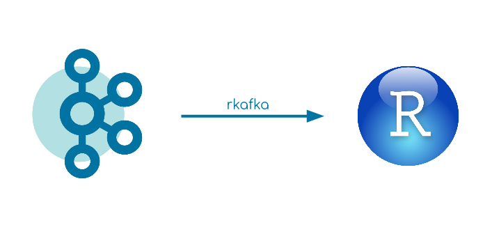
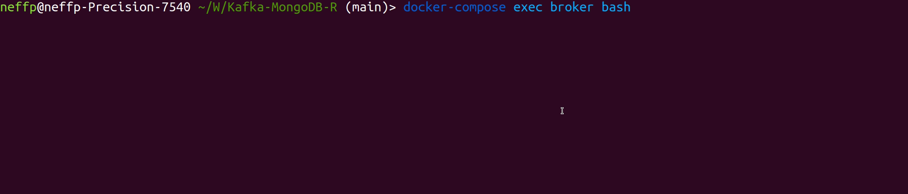
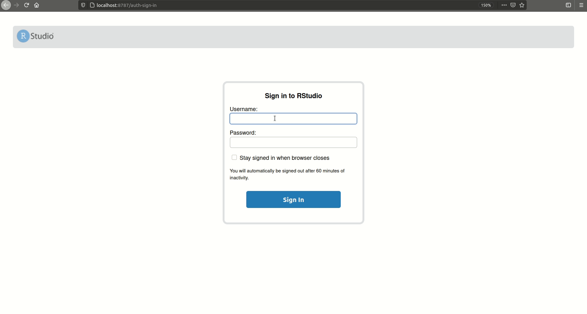

# Kafka-R

[![LinkedIn][linkedin-shield]][linkedin-url]



This small tutorial creates a data pipeline from Apache Kafka into R using the [rkafka](https://cran.rstudio.com/web/packages/rkafka/rkafka.pdf) package.
It focuses on simplicity and can be seen as a baseline for similar projects.


[linkedin-shield]: https://img.shields.io/badge/-LinkedIn-black.svg?style=flat-square&logo=linkedin&colorB=555
[linkedin-url]: https://www.linkedin.com/in/patrick-neff-7bb3b21a4/

## Prerequisites

* [docker](https://docs.docker.com/get-docker/)
* [docker-compose](https://docs.docker.com/compose/install/)

## Set up

```
docker-compose up -d
```
It starts:
* Zookeeper
* Kafka Broker
* Kafka Producer
  * built docker image executing fat JAR
* RStudio
    * built docker image RStudio with [rJava](https://cran.r-project.org/web/packages/rJava/rJava.pdf) installed which is required for [rkafka](https://cran.rstudio.com/web/packages/rkafka/rkafka.pdf)

## Kafka Producer

The Kafka Producer produces fake events of a driving truck into the topic `truck-topic` in `JSON` format every two seconds.
Verify that data is produced correctly:
```
docker-compose exec broker bash
kafka-console-consumer --bootstrap-server broker:9092 --topic truck-topic
```


## RStudio
Open RStudio via:
```
localhost:8787
```
The username is `user` and password `password`.

Under `/home` you can run `Data.R`. It first creates a `simpleConsumer`, then requests all data from the beginning of the topic
and finally converts the JSON string into a dataframe with [jsonlite](https://cran.r-project.org/web/packages/jsonlite/jsonlite.pdf). 



## Sources

* [Confluent Docker-Compose file](https://github.com/confluentinc/cp-all-in-one/blob/6.1.1-post/cp-all-in-one/docker-compose.yml)
* [Confluent Docker Configuration Parameters](https://docs.confluent.io/platform/current/installation/docker/config-reference.html)
* [rkafka Package](https://cran.rstudio.com/web/packages/rkafka/rkafka.pdf)
* [jsonlite Package](https://cran.r-project.org/web/packages/jsonlite/jsonlite.pdf)